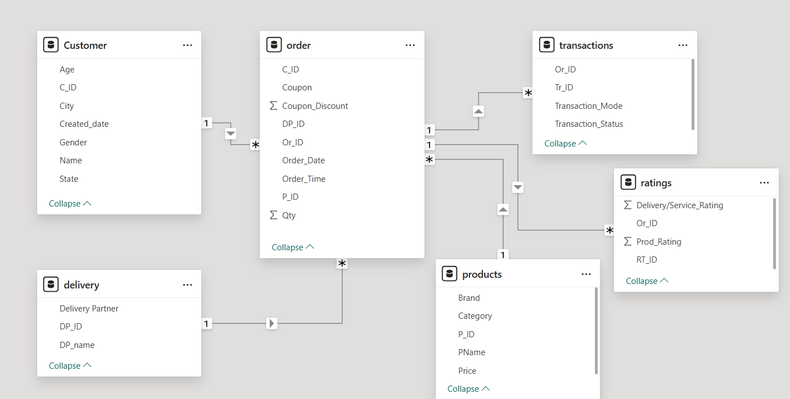

# Zepto Quick-Commerce Business Analysis (SQL)

SQL analysis of a quick-commerce dataset — 20 queries across customer
retention, revenue, payments, and delivery performance, built on a
6-table relational schema.

> Note: synthetic practice dataset (~15K rows/table). Focus is SQL
> technique, not real-world findings.

## Skills
Multi-table joins · window functions (LEAD/LAG) · CTEs · aggregation ·
date/time functions · business KPIs (retention %, MoM growth, success rate).

## Data Model

Six tables — customer, products, orders, transactions, ratings, delivery —
centered on the orders table.

## What's Answered
Top customers · repeat vs one-time buyers · avg days between orders · MoM
product growth · revenue by city/category · payment success by method ·
delivery-partner performance.

## Tech Stack
MySQL · Excel · Power BI

## Run
Run `zepto_analysis.sql` to build the schema, load the CSVs in `data/`, then
run the queries.
